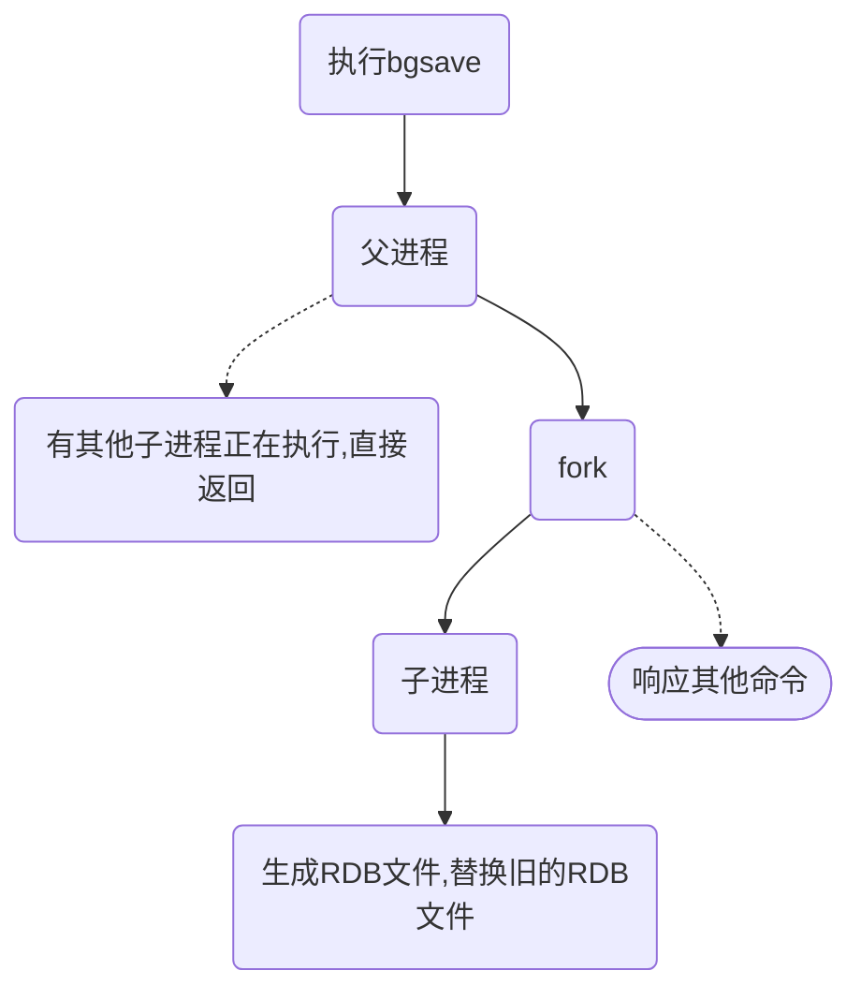
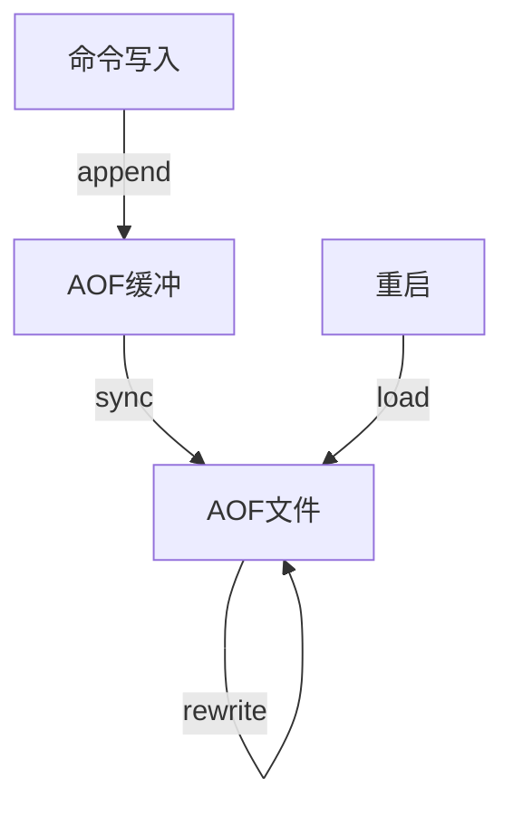

[TOC]

### Redis是什么？

Redis是一个使用c语言编写的，高性能非关系型的键值对数据库。与传统数据库不同的是，Redis的数据是存在内存中的，所以读写速度非常快，被广泛应用于缓存方向。Redis可以将数据写入磁盘中，保证了数据的安全不丢失，而且Redis的操作是原子性的。

### Redis优缺点？

**优点：**

1. 基于内存操作，内存读写速度快。
2. Redis是单线程的，避免线程切换开销及多线程的竞争问题。这里的单线程指的是网络请求使用一个线程来处理，即一个线程处理所有请求，但其运行时不止有一个线程，比如数据持久化过程中会另起线程。
3. 支持多数据类型，包括String、Hash、List、Set、ZSet等。
4. 支持持久化。Redis支持RDB和AOF两种持久化机制，持久化功能可以有效避免数据丢失问题。
5. 支持事务，Redis所有操作都是原子性的，同时还支持对多个操作合并后的原子性执行，但需要注意的是redis的事务并不保证原子性，具体可以看后面有关事务特性的介绍。
6. 支持主从复制，主节点会自动将数据同步到从节点，可以进行读写分离。

**缺点：**

1. 对结构化查询的支持比较差。
2. 数据库容量受到物理内存的限制，不适合用作海量数据的高性能读写，因此Redis适合的场景主要局限在较小数据量的操作。
3. Redis较难支持在线扩容，在集群容量达到上限时扩容会变得很复杂。

### Redis为什么这么快？

- 基于内存:使用内存存储使得Redis没有磁盘IO上的开销，数据存在内存中，读写速度快。
- 单线程实现（Redis6.0以前）：Redis使用单个线程处理请求，避免了多个线程之间线程切换和锁资源争用的开销。
- IO多路复用模型：Redis采用IO多路复用技术。Redis使用单线程来轮询描述符，将数据库的操作都转换成了时间，不在网络I/O上浪费过多的时间。
- 高效的数据结构：Redis每种数据类型底层都做了优化，目的就是为了追求更快的速度。

### Redis为何选择单线程？

- 避免过多的上下文切换开销，程序始终运行在线程中单个线程内，无多线程切换的场景。
- 避免同步机制的开销，如果Redis选择多线程模型，需要考虑数据同步的问题，则必然会引入某些同步机制，会导致在操作数据过程中带来更多的开销，增加程序复杂度的同时还会降低性能。
- 实现简单，方便维护：如果Redis使用多线程模式，那么所有的底层数据结构的设计都必须考虑线程安全问题，那么Redis的实现将会变得更加复杂。

### Redis6.0为何引入多线程？

这里的多线程指的主要是Redis网络处理方面，执行命令的核心模块还是单线程 的。

两个原因：

- 可以充分利用服务器CPU资源，单线程模型只能利用一个CPU；
- 多线程任务可以分摊Redis同步IO读写的负荷。

### Redis的应用场景有哪些？

1. 缓存热点数据，缓解数据库的压力。
2. 利用Redis原子性的自增操作，可以实现计数器的功能，比如统计用户点赞数，用户访问数等。
3. 简单的消息队列，可以使用Redis自身的发布/订阅模式或者List来实现简单的消息队列，实现异步操作。
4. 限速器，可用于限制某个用户访问某个接口的快速点击带来不必要的压力。
5. 好友关系，利用集合的一些命令如交并补等实现共同好友、共同爱好之类的功能。

### Memcached和Redis的区别？

1. Redis只使用单核，而Memcached可以使用多核。
2. Redis支持多种数据类型，而前者数据结构单一仅用来缓存数据。
3. Redis支持数据持久化，而前者不支持，重启后数据会消失。
4. Redis提供主从同步机制和cluster集群部署功能，能够提供高可用服务。Memcached没有提供原生的集群模式，需要依靠客户端实现往集群中分片写入数据。
5. Redis的速度比Memcached快很多。
6. Redis使用单线程的多路IO复用模型，Memcached使用多线程的非阻塞IO模型。

### Redis数据类型有哪些？

**基本数据类型：**

1. String：最常用的一种数据类型，其值可以是字符串、数字或者是二进制，但值最大不能超过512MB。
2. Hash：是一个键值对集合。适合用于存储对象。
3. Set：无序去重的集合，Set提供了交并补等方法。
4. List：有序可重复的集合，底层以双向链表来实现，当数据量比较多的时候会采用quicklist实现。
5. ZSet：有序Set，内部维护了一个score的参数来实现，使用于排行榜和带权重的消息队列等场景。底层采用hash和跳表实现。

**特殊的数据类型：**

1. Bitmap:位图，可以认为是一个以位为单位的数组，数组的每个单元只能存0或者1，数组的下标在Bitmap中叫做偏移量，其长度与集合中元素个数无关，而与基数的上限有关。
2. HyperLogLog：是用来做基数统计的算法，优点是，在输入元素的数量或者体积非常非常大时，计算基数所需的空间总是固定的、并且是很小的。典型的使用场景就是统计独立访客。
3. Geospatial：主要用于存储地理位置信息，并对存储的信息进行操作，适用场景如定位，计算距离，附近的人等。

### Keys命令存在的问题？

Redis是单线程的，keys指令会导致线程阻塞一段时间，直到执行完毕，服务才能恢复。scan采用渐进式遍历的方式来解决keys命令可能带来的阻塞问题，每次scan命令的时间复杂度是O(1)，但是要真正实现keys的功能，需要执行多次scan。

scan的缺点：在scan过程中如果有键的变化（CUD），遍历过程可能会有以下问题：新增的键可能没有遍历到，遍历出来重复的键等情况，也就是说scan并不能保证完整地遍历出来所有的键。

### ZSet和List异同点？

**相同点：**

1. 都是有序的；
2. 都可以获得某个范围内的元素。

**不同点：**

1. 列表基于链表实现，获取两端元素速度快，访问中间元素速度慢；
2. ZSet基于散列表和跳跃表实现，访问中间元素时间复杂度是Olog N；
3. 列表不能简单的调整某个元素的位置，有序列表可以（更改元素的分数）；
4. ZSet更耗内存。

### Redis事务

Redis事务是一个单独的隔离操作：事务中的所有命令都会序列化、按顺序地执行。事务在执行的过程中，不会被其他客户端发送来的命令请求所打断。

Redis事务的主要作用就是串联多个命令防止别的命令插队。

**相关命令：**

1. multi、exec、discard

​	**说明：**从输入Multi命令开始，输入的命令都会依次进入命令队列中，但不会执行，直到输入Exec后，Redis会将之前的命令队列中的命令依次执行。同时，组队的过程中可以通过discard来放弃组队。

2. watch、unwatch

​	**说明：**

- 在执行multi之前，先执行watch key1 [key2],可以监视一个(或多个) key ，如果在事务**执行之前这个(或这些) key 被其他命令所改动，那么事务将被打断。**

- unwatch用于取消 watch 命令对所有 key 的监视。
- 如果在执行 watch 命令之后，exec 命令或discard命令先被执行了的话，那么就不需要再执行unwatch 了。

**事务的错误处理：**

- 组队中某个命令出现了报告错误，p执行时整个的所有队列都会被取消。

- 如果执行阶段某个命令报出了错误，则只有报错的命令不会被执行，而其他的命令都会执行，不会回滚。这样看来redis的事务确实不保证原子性。

### 持久化机制

持久化就是把内存的数据写到磁盘中，防止服务宕机导致内存数据丢失。

Redis支持两种方式的持久化，一种是```RDB```的方式，一种是```AOF```的方式。前者会根据指定的规则定时将内存中的数据存储在硬盘上，而后者在每次执行完命令后将命令记录下来。一般我们将两者结合使用。

#### RDB方式

RDB是Redis默认的持久化方案。RDB持久化时会将内存中的数据写到磁盘中，在指定目录下生成一个dump.rdb文件。Redis重启会加载此文件恢复数据。

bgsave是主流的触发RDB持久化的方式，执行过程如下：



- 执行bgsave命令；
- Redis父进程判断当前是否存在正在执行的子进程，如果存在，bgsave命令直接返回；
- 父进程执行fork操作创建子进程，fork操作过程中父进程会阻塞；
- 父进程fork完成后，父进程继续接收并处理客户端的请求，而子进程开始将内存中的数据写进硬盘的临时文件；
- 当子进程写完所有数据后会用该临时文件替换旧的RDB文件。

Redis启动时会读取RDB快照文件，讲数据从硬盘载入内存。通过RDB方式的持久化，一旦Redis异常退出，就会丢失最近一次持久化以后更改的数据。

触发RDB持久化的方式：

1. 手动触发：用户执行```save```或```bgsave```命令。```save```命令执行快照的过程会阻塞所有客户端的请求，应避免在生产环境使用此命令。```bgsave```命令可以在后台异步进行快照操作，快照的同时副武器还可以继续响应客户端的请求，因此需要手动执行快照时推荐使用```bgsave```命令。
2. 被动触发：

- 根据配置规则进行自动快照，如```save 100 10```,100秒内至少有10个键被修改则进行快照。
- 如果从节点执行全量复制操作，主节点会自动执行```bgsave```生成RDB文件并发送给从节点。
- 默认情况下执行```shutdown```命令时，如果没有开启AOF持久化功能则自动执行```bgsave```。

优点：

1. Redis加载RDB恢复数据远远快于AOF的方式。
2. 使用单独子进程来进行持久化，主进程不会进行任何IO操作，保证了Redis的高性能。

缺点：

1. RDB方式数据无法做到实时持久化，因为`bgsave`每次运行都要执行```fork```操作创建子进程，属于重量级操作，频繁执行成本比较高。
2. RDB文件使用特定二进制格式保存，Redis版本升级过程中有多个格式的RDB版本，存在老版本Redis无法兼容新版RDB格式的问题。

#### AOF方式

AOF（Append Only File）持久化：以独立日志的方式记录每次写命令，Redis重启时会执行AOF文件中的命令达到恢复数据的目的。AOF的主要作用就是解决了数据持久化的实时性，AOF是Redis持久化的主流方式。

默认情况下Redis没有开启AOF方式的持久化，可以通过`appendonly`参数启用：`appendonly yes`。开启AOF方式持久化后每执行一条写命令，Redis就会将该命令写进`aof_buf`缓冲区，AOF缓冲区根据对应的策略向硬盘做同步操作。

默认情况下系统每30秒会执行一次同步操作。为了防止缓冲区数据丢失，可以在Redis写入AOF文件后主动要求将缓冲区数据同步到硬盘上。可以通过`appendfsync`参数设置同步的时机。

```shell
appendfsync always //每次写入aof文件都会执行同步，最安全最慢，不建议配置
appendfsync everysec  //既保证性能也保证安全，建议配置
appendfsync no //由操作系统决定何时进行同步操作
```

下面是AOF持久化执行流程：



1. 所有的写入命令会追加到AOF缓冲区中；
2. AOF缓冲区根据对应的策略向硬盘同步；
3. 随着AOF文件越来越大，需要定期对AOF文件进行重写，达到压缩文件体积的目的。AOF文件重写是把Redis进程内的数据转化为写命令同步到AOF文件的过程。
4. 当Redis服务器重启时，可以加载AOF文件进行数据恢复。

优点：

1. AOF可以更好地保护数据不丢失，可以配置AOF每秒执行一次`fsync`操作，如果Redis进程挂掉，最多丢失1秒的数据。
2. AOF以`append-only`的模式写入，所以没有磁盘寻址的开销，写入性能非常高。

缺点：

1. 对于同一份文件AOF文件比RDB快照要大
2. 数据恢复比较慢

### RDB和AOF如何选择？

通常来说，应该同时使用两种持久化方案，以保证数据安全。

- 如果数据不敏感，且可以从其他地方重新生成，可以关闭持久化。
- 如果数据比较重要，且能够承受几分钟的数据丢失，比如缓存等，只需要使用RDB即可。
- 如果是用做内存数据，要使用redis的持久化，建议是二者都开启。
- 如果只用AOF，优先使用everysec的配置选择，因为它在可靠性和性能之间取了一个平衡。

当RDB与AOF两种方式都开启时，Redis会优先使用AOF恢复数据，因为AOF保存的文件比RDB文件更完整。

### Redis常见的部署方式有哪些？

Redis的几种常见使用方式包括：

- 单机版
- Redis主从
- Redis Sentinel（哨兵）
- Redis Cluster（集群）

**使用场景**：

单机版：很少使用。存在的问题：1、内存容量有限 2、处理能力有限 3、无法高可用。

主从模式：master节点挂掉后，需要手动指定新的master，可用性不高，基本不用。

哨兵模式：master节点挂掉后，哨兵进程会主动选举新的master，可用性高，但是每个节点存储的数据是一样的，浪费内存空间，数据量不是很多，集群规模不是很大，需要自动容错容灾的时候使用。

Redis cluster：主要是针对海量数据+高并发+高可用的场景，如果是海量数据，如果你的数据量很大，那么建议就用Redis Cluster，所有主节点的容量总和就是Redis Cluster可缓存的数据总量。

### 主从复制

Redis的复制功能是支持多个数据库之间的数据同步。主数据库可以进行读写操作，当主数据库的数据发生变化时会自动将数据同步到从数据库。从数据库一般是**只读**的，它会接收主数据库同步过来的数据。一个主数据库可以有多个从数据库，而一个从数据库只能有一个主数据库。

```shell
redis-server //启动Redis实例作为主数据库 
redis-server --port 6380 --slaveof  127.0.0.1 6379  //启动另一个实例作为从数据库 
slaveof 127.0.0.1 6379
SLAVEOF NO ONE //停止接收其他数据库的同步并转化为主数据库。
```

**主从复制的原理？**

1. 当启动一个从节点时，它会发送一个 `PSYNC` 命令给主节点； 
2. 如果是从节点初次连接到主节点，那么会触发一次全量复制。此时主节点会启动一个后台线程，开始生成一份 `RDB` 快照文件； 
3. 同时还会将从客户端 client 新收到的所有写命令缓存在内存中。`RDB` 文件生成完毕后， 主节点会将`RDB`文件发送给从节点，从节点会先将`RDB`文件**写入本地磁盘，然后再从本地磁盘加载到内存中**； 
4. 接着主节点会将内存中缓存的写命令发送到从节点，从节点同步这些数据； 
5. 如果从节点跟主节点之间网络出现故障，连接断开了，会自动重连，连接之后主节点仅会将部分缺失的数据同步给从节点。

### 哨兵(Sentinel)

主从复制存在不能自动故障转移、达不到高可用的问题。哨兵模式解决了这些问题。通过哨兵机制可以自动切换主从节点。

客户端连接Redis的时候，先连接哨兵，哨兵会告诉客户端Redis主节点的地址，然后客户端连接上Redis并进行后续的操作。当主节点宕机的时候，哨兵监测到主节点宕机，会重新推选出某个表现良好的从节点成为新的主节点，然后通过发布订阅模式通知其他的从服务器，让它们切换主机。

**工作原理**

- 每个`Sentinel`以每秒钟一次的频率向它所知道的`Master`，`Slave`以及其他 `Sentinel`实例发送一个 `PING`命令。 
- 如果一个实例距离最后一次有效回复 `PING` 命令的时间超过指定值， 则这个实例会被 `Sentine` 标记为主观下线。 
- 如果一个`Master`被标记为主观下线，则正在监视这个`Master`的所有 `Sentinel`要以每秒一次的频率确认`Master`是否真正进入主观下线状态。 
- 当有足够数量的 `Sentinel`（大于等于配置文件指定值）在指定的时间范围内确认`Master`的确进入了主观下线状态， 则`Master`会被标记为客观下线 。若没有足够数量的 `Sentinel`同意 `Master` 已经下线， `Master` 的客观下线状态就会被解除。 若 `Master`重新向 `Sentinel` 的 `PING` 命令返回有效回复， `Master` 的主观下线状态就会被移除。 
- 哨兵节点会选举出哨兵 leader，负责故障转移的工作。 
- 哨兵 leader 会推选出某个表现良好的从节点成为新的主节点，然后通知其他从节点更新主节点信息

### Redis cluster

哨兵模式解决了主从复制不能自动故障转移、达不到高可用的问题，但还是存在主节点的写能力、容量受限于单机配置的问题。而cluster模式实现了Redis的分布式存储，每个节点存储不同的内容，解决主节点的写能力、容量受限于单机配置的问题。

Redis cluster集群节点最小配置6个节点以上（3主3从），其中主节点提供读写操作，从节点作为备用节点，不提供请求，只作为故障转移使用。

Redis cluster采用**虚拟槽分区**，所有的键根据哈希函数映射到0～16383个整数槽内，每个节点负责维护一部分槽以及槽所映射的键值数据。

**优点：**

- 无中心架构，**支持动态扩**容； 
- 数据按照`slot`存储分布在多个节点，节点间数据共享，**可动态调整数据分布**； 
- **高可用性**。部分节点不可用时，集群仍可用。集群模式能够实现自动故障转移（failover），节点之间通过`gossip`协议交换状态信息，用投票机制完成`Slave`到`Master`的角色转换。 

**缺点：**

- **不支持批量操作**（pipeline）。 
- 数据通过异步复制，**不保证数据的强一致性**。 
- **事务操作支持有限**，只支持多`key`在同一节点上的事务操作，当多个`key`分布于不同的节点上时无法使用事务功能。 
- `key`作为数据分区的最小粒度，不能将一个很大的键值对象如`hash`、`list`等映射到不同的节点。 
- **不支持多数据库空间**，单机下的Redis可以支持到16个数据库，集群模式下只能使用1个数据库空间。

#### 哈希分区算法有哪些？

节点取余分区。使用特定的数据，如Redis的键或用户ID，对节点数量N取余：hash（key）%N计算出哈希值，用来决定数据映射到哪一个节点上。
优点是简单性。扩容时通常采用翻倍扩容，避免数据映射全部被打乱导致全量迁移的情况。

一致性哈希分区。为系统中每个节点分配一个token，范围一般在0~232，这些token构成一个哈希环。数据读写执行节点查找操作时，先根据key计算hash值，然后顺时针找到第一个大于等于该哈希值的token节点。
这种方式相比节点取余最大的好处在于加入和删除节点只影响哈希环中相邻的节点，对其他节点无影响。

虚拟槽分区，所有的键根据哈希函数映射到0~16383整数槽内，计算公式：slot=CRC16（key）%16383。每一个节点负责维护一部分槽以及槽所映射的键值数据。**Redis Cluser采用虚拟槽分区[算法]()。

### 过期键的删除策略？

1、**被动删除**。在访问key时，如果发现key已经过期，那么会将key删除。

2、**主动删除**。定时清理key，每次清理会依次遍历所有DB，从db随机取出20个key，如果过期就删除，如果其中有5个key过期，那么就继续对这个db进行清理，否则开始清理下一个db。

3、**内存不够时清理**。Redis有最大内存的限制，通过maxmemory参数可以设置最大内存，当使用的内存超过了设置的最大内存，就要进行内存释放， 在进行内存释放的时候，会按照配置的淘汰策略清理内存。

### 内存淘汰策略有哪些？

当Redis的内存超过最大允许的内存之后，Redis 会触发内存淘汰策略，删除一些不常用的数据，以保证Redis服务器正常运行。

**Redisv4.0前提供 6 种数据淘汰策略**：

- **volatile-lru**：LRU（`Least Recently Used`），最近使用。利用LRU[算法]()移除设置了过期时间的key 
- **allkeys-lru**：当内存不足以容纳新写入数据时，从数据集中移除最近最少使用的key 
- **volatile-ttl**：从已设置过期时间的数据集中挑选将要过期的数据淘汰 
- **volatile-random**：从已设置过期时间的数据集中任意选择数据淘汰 
- **allkeys-random**：从数据集中任意选择数据淘汰 
- **no-eviction**：禁止删除数据，当内存不足以容纳新写入数据时，新写入操作会报错 

**Redisv4.0后增加以下两种**：

- **volatile-lfu**：LFU，Least Frequently Used，最少使用，从已设置过期时间的数据集中挑选最不经常使用的数据淘汰。 
- **allkeys-lfu**：当内存不足以容纳新写入数据时，从数据集中移除最不经常使用的key。 

**内存淘汰策略可以通过配置文件来修改**，相应的配置项是`maxmemory-policy`，默认配置是`noeviction`。

### 如何保证缓存与数据库双写时的数据一致性？

**1、先删除缓存再更新数据库**

进行更新操作时，先删除缓存，然后更新数据库，后续的请求再次读取时，会从数据库读取后再将新数据更新到缓存。

存在的问题：删除缓存数据之后，更新数据库完成之前，这个时间段内如果有新的读请求过来，就会从数据库读取旧数据重新写到缓存中，再次造成不一致，并且后续读的都是旧数据。

**2、先更新数据库再删除缓存**

进行更新操作时，先更新MySQL，成功之后，删除缓存，后续读取请求时再将新数据回写缓存。

存在的问题：更新MySQL和删除缓存这段时间内，请求读取的还是缓存的旧数据，不过等数据库更新完成，就会恢复一致，影响相对比较小。

**3、异步更新缓存**

数据库的更新操作完成后不直接操作缓存，而是把这个操作命令封装成消息扔到消息队列中，然后由Redis自己去消费更新数据，消息队列可以保证数据操作顺序一致性，确保缓存系统的数据正常。

### 缓存穿透

缓存穿透是指查询一个**不存在的数据**，由于缓存是不命中时被动写的，如果从DB查不到数据则不写入缓存，这将导致这个不存在的数据每次请求都要到DB去查询，失去了缓存的意义。在流量大时，可能DB就挂掉了。

解决方法：

1. **缓存空值**，不会查数据库。 
2. 采用**布隆过滤器**，将所有可能存在的数据哈希到一个足够大的`bitmap`中，查询不存在的数据会被这个`bitmap`拦截掉，从而避免了对`DB`的查询压力。 

布隆过滤器的原理：当一个元素被加入集合时，通过K个散列函数将这个元素映射成一个位数组中的K个点，把它们置为1。查询时，将元素通过散列函数映射之后会得到k个点，如果这些点有任何一个0，则被检元素一定不在，直接返回；如果都是1，则查询元素很可能存在，就会去查询Redis和数据库。

### 缓存雪崩

缓存雪崩是指在我们设置缓存时采用了相同的过期时间，**导致缓存在某一时刻同时失效**，请求全部转发到DB，DB瞬时压力过重挂掉。

解决方法：在原有的失效时间基础上**增加一个随机值**，使得过期时间分散一些。

### 缓存击穿

缓存击穿：大量的请求同时查询一个 key 时，此时这个 key 正好失效了，就会导致大量的请求都落到数据库。**缓存击穿是查询缓存中失效的 key，而缓存穿透是查询不存在的 key。**

解决方法：加**分布式锁**，第一个请求的线程可以拿到锁，拿到锁的线程查询到了数据之后设置缓存，其他的线程获取锁失败会等待50ms然后重新到缓存取数据，这样便可以避免大量的请求落到数据库。

```shell
set sku:1:info “OK” NX PX 10000		// 使用此命令可以实现设置分布式锁的原子性操作，过期时间为10000秒
```

**注意：**

为了确保分布式锁可用，我们至少要确保锁的实现同时**满足以下四个条件**：

\- 互斥性。在任意时刻，只有一个客户端能持有锁。

\- 不会发生死锁。即使有一个客户端在持有锁的期间崩溃而没有主动解锁，也能保证后续其他客户端能加锁。（设置锁过期时间）

\- 解铃还须系铃人。加锁和解锁必须是同一个客户端，客户端自己不能把别人加的锁给解了。（通过uuid对key进行命名）

\- 加锁和解锁必须具有原子性。（通过lua脚本）

```java
public void testLockLua() {
    //1 声明一个uuid ,将做为一个value 放入我们的key所对应的值中
    String uuid = UUID.randomUUID().toString();
    //2 定义一个锁：lua 脚本可以使用同一把锁，来实现删除！
    String skuId = "25"; // 访问skuId 为25号的商品 100008348542
    String locKey = "lock:" + skuId; // 锁住的是每个商品的数据

    // 3 获取锁
    Boolean lock = redisTemplate.opsForValue().setIfAbsent(locKey, uuid, 3, TimeUnit.SECONDS);

    // 第一种： lock 与过期时间中间不写任何的代码。
    // redisTemplate.expire("lock",10, TimeUnit.SECONDS);//设置过期时间
    // 如果true
    if (lock) {
        // 执行的业务逻辑开始
        // 获取缓存中的num 数据
        Object value = redisTemplate.opsForValue().get("num");
        // 如果是空直接返回
        if (StringUtils.isEmpty(value)) {
            return;
        }
        // 不是空 如果说在这出现了异常！ 那么delete 就删除失败！ 也就是说锁永远存在！
        int num = Integer.parseInt(value + "");
        // 使num 每次+1 放入缓存
        redisTemplate.opsForValue().set("num", String.valueOf(++num));
        /*使用lua脚本来锁*/
        // 定义lua 脚本
        String script = "if redis.call('get', KEYS[1]) == ARGV[1] then return redis.call('del', KEYS[1]) else return 0 end";
        // 使用redis执行lua执行
        DefaultRedisScript<Long> redisScript = new DefaultRedisScript<>();
        redisScript.setScriptText(script);
        // 设置一下返回值类型 为Long
        // 因为删除判断的时候，返回的0,给其封装为数据类型。如果不封装那么默认返回String 类型，
        // 那么返回字符串与0 会有发生错误。
        redisScript.setResultType(Long.class);
        // 第一个要是script 脚本 ，第二个需要判断的key，第三个就是key所对应的值。
        redisTemplate.execute(redisScript, Arrays.asList(locKey), uuid);
    } else {
        // 其他线程等待
        try {
            // 睡眠
            Thread.sleep(1000);
            // 睡醒了之后，调用方法。
            testLockLua();
        } catch (InterruptedException e) {
            e.printStackTrace();
        }
    }
}
```

### Redis 怎么实现消息队列？

使用一个列表，让生产者将任务使用LPUSH命令放进列表，消费者不断用RPOP从列表取出任务。

>  BRPOP和RPOP命令相似，唯一的区别就是当列表没有元素时BRPOP命令会一直阻塞连接，直到有新元素加入。

```
BRPOP queue 0  //0表示不限制等待时间
```

**优先级队列**

如果多个键都有元素，则按照从左到右的顺序取元素。

```
BLPOP queue:1 queue:2 queue:3 0
```

**发布/订阅模式**

`PSUBSCRIBE channel?*` 按照规则订阅。
`PUNSUBSCRIBE channel?*` 退订通过PSUBSCRIBE命令按照某种规则订阅的频道。其中订阅规则要进行严格的字符串匹配，`PUNSUBSCRIBE *`无法退订`channel?*`规则。

```
PUBLISH channel1 hi
SUBSCRIBE channel1
UNSUBSCRIBE channel1 //退订通过SUBSCRIBE命令订阅的频道。
```

缺点：在消费者下线的情况下，生产的消息会丢失。

**延时队列**

使用sortedset，拿时间戳作为score，消息内容作为key，调用zadd来生产消息，消费者用`zrangebyscore`指令获取N秒之前的数据轮询进行处理。

### pipeline的作用？

[redis]()客户端执行一条命令分4个过程： 发送命令、命令排队、命令执行、返回结果。使用`pipeline`可以批量请求，批量返回结果，执行速度比逐条执行要快。

使用`pipeline`组装的命令个数不能太多，不然数据量过大，增加客户端的等待时间，还可能造成网络阻塞，可以将大量命令的拆分多个小的`pipeline`命令完成。

原生批命令（mset和mget）与`pipeline`对比：

1. 原生批命令是原子性，`pipeline`是**非原子性**。pipeline命令中途异常退出，之前执行成功的命令**不会回滚**。
2. 原生批命令只有一个命令，但`pipeline`**支持多命令**。

### LUA脚本

Redis 通过 LUA 脚本创建具有原子性的命令： 当lua脚本命令正在运行的时候，不会有其他脚本或 Redis 命令被执行，实现组合命令的原子操作。

在Redis中执行Lua脚本有两种方法：`eval`和`evalsha`。`eval`命令使用内置的 Lua 解释器，对 Lua 脚本进行求值。

```
//第一个参数是lua脚本，第二个参数是键名参数个数，剩下的是键名参数和附加参数
> eval "return {KEYS[1],KEYS[2],ARGV[1],ARGV[2]}" 2 key1 key2 first second
1) "key1"
2) "key2"
3) "first"
4) "second"
```

**lua脚本作用**

1、Lua脚本在Redis中是原子执行的，执行过程中间不会插入其他命令。

2、Lua脚本可以将多条命令一次性打包，有效地减少网络开销。

### 什么是RedLock？

Redis 官方站提出了一种权威的基于 Redis 实现分布式锁的方式名叫 *Redlock*，此种方式比原先的单节点的方法更安全。它可以保证以下特性：

1. 安全特性：互斥访问，即永远只有一个 client 能拿到锁 
2. 避免死锁：最终 client 都可能拿到锁，不会出现死锁的情况，即使原本锁住某资源的 client 挂掉了 
3. 容错性：只要大部分 Redis 节点存活就可以正常提供服务
