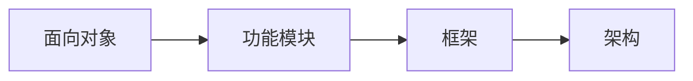

### 关键词

如何向别人介绍？


#### 七大设计原则（SOLID）

- 单一职责原则（Single Responsibility Principle）

> 一个类应该只负责一项职责。
>
> 只有代码逻辑足够简单，才可以违反单一职责原则，只有类内的方法足够少，才可以仅在方法层面实现单一职责原则。

- 开闭原则（Open Closed Principle）

> 对扩展开放，对修改关闭

- 里氏替换原则（Liskov Substitution Principle）

> 在所有引用基类的地方必须能透明地使用其子类的对象。
>
> 在继承时，子类不要重写父类的方法。
>
> 在适当的时候，可以通过聚合、组合、依赖来解决问题。

- 迪米特法则（Law Of Demeter）

> 一般称出现在成员变量、方法参数、方法返回值的类为该类的直接朋友，意味着陌生的类最好不要以局部变量的形式出现在类的内部。

- 接口隔离原则（Interface Segregation Principle[**ISP**])

> 客户端不应该依赖它不需要的接口，即一个类对另一个类的依赖应该建立在最小的接口上。

- 依赖倒置原则（Dependence Inversion Principle[**DIP**])

> 程序应该依赖于抽象接口，细节依赖于（具体实现）接口。

```java
package com.atguigu.principle.inversion.improve;

public class DependecyInversion {

	public static void main(String[] args) {
		//客户端无需改变
		Person person = new Person();
		person.receive(new Email());
		
		person.receive(new WeiXin());
	}

}

//定义接口
interface IReceiver {
	public String getInfo();
}

class Email implements IReceiver {
	public String getInfo() {
		return "电子邮件信息: hello,world";
	}
}

//增加微信
class WeiXin implements IReceiver {
	public String getInfo() {
		return "微信信息: hello,ok";
	}
}

//方式2
class Person {
	//这里我们是对接口的依赖
	public void receive(IReceiver receiver ) {
		System.out.println(receiver.getInfo());
	}
}

```


#### UML类图

#### 源码剖析

代码分析+Debug+对应模式分析说明

#### 常见应用

状态模式：例如金融项目中的贷款申请的状态更新

解释器模式

### 设计模式分类

#### 创建型（5）

单例模式、抽象工厂模式、原型模式、建造者模式、工厂模式

#### 结构型（7）

适配器模式、桥接模式、装饰模式、组合模式、外观模式、享元模式、代理模式

#### 行为型（11）

模板方法模式、命令模式、访问者模式、迭代器模式、观察者模式、中介者模式、备忘录模式、解释器模式（Interpreter模式）、状态模式、策略模式、职责链模式（责任链模式）

### 单例模式

> 采取一定方法保证在整个软件系统中，对某个类只能存在一个对象实例，并且该类只提供一个取得其对象实例的方法（静态方法）。

1. 饿汉式（静态变量）

```java
class Singleton{
    // 1. 构造器私有化，外部不能new
    private Singleton(){
        
    }
    // 2. 类内部创建对象实例
    private final static Singleton instance = new Singleton();
    
    // 3. 提供一个公有的静态方法，返回对象实例
    public static Singleton getInstance(){
        return instance;
    }
}
```

> 优点：简单，类加载时便实例化，避免了多线程同步问题。
>
> 缺点：没有Lazy Loading效果，如果实例未被使用，会造成内存浪费。
>
> 结论：可用，但可能造成内存浪费。

2. 饿汉式（静态代码块）

```java
class Singleton{
    private Singleton(){
        
    }
    private static Singleton instance;
    static{// 在静态代码块中，创建单例对象
        instance = new Singleton();
    }
    public static Singleton getInstance(){
        return instance;
    }
}
```

优缺点及结论同上。

3. 懒汉式（线程不安全）

```java
class Singleton{
    private static Singleton instance;
    private Singleton(){}
    // 提供一个静态的公有方法，当使用到该方法时，才去创建instance
    public static Singleton getInstance(){
        if(instance == null){
            instance = new Singleton();
        }
        return instance;
    }
}
```

> 优缺点：
>
> 起到了Lazy Loading的效果，但只能在单线程下使用，多线程环境下容易产生多个实例，所以在实际开发中不要使用这种方式。

4. 懒汉式（线程安全，同步方法）


> 优缺点：
>
> 解决了线程安全问题；效率太低了，每次执行getInstance方法都要进行同步，其实只需要执行一次实例化代码就够了，后续直接return就行了，方法进行同步效率太低，所以不推荐使用。

5. 懒汉式（线程安全，同步代码块）


不推荐使用。

6. 双重检查

```java
class Singleton{
    private static volatile Singleton instance;
    private Singleton(){}
    // 提供一个静态公有方法，加入双重检查，同时解决线程安全及懒加载问题。
    public static synchronized Singleton getInstance(){
        if(instance == null){
            synchronized(Singleton.class){
                if(instance == null){
                    instance = new Singleton();
                }
            }
        }
        return instance;
    }
}
```

> 优缺点：
>
> 双重检查可以在保证线程安全的同时，避免反复进行方法同步；
>
> **线程安全，延迟加载，效率较高；**
>
> 在实际开发中，推荐使用这种单例设计模式。

7. 静态内部类

```java
class Singleton{
    private static volatile Singleton instance;
    private Singleton(){}
    // 写一个静态内部类，该类中有一个静态属性Singleton
    private static class SingletonInstance{
        private static final Singleton INSTANCE = new Singleton();
    }
    // 提供静态公有方法，直接返回内部类的静态属性。
    public static synchronized Singleton getInstance(){
        return SingletonInstance.INSTANCE;
    }
}
```

> 优缺点：
>
> 采用了类加载的机制来保证初始化实例时只有一个线程；
>
> 静态内部类方式在Singleton类加载时不会立即实例化，而是在需要实例化时调用getInstance方法，才会装载SingletonInstance类，从而完成Singleton的实例化；
>
> 类的静态属性只会在第一次加载类的时候初始化，JVM帮助保证了线程安全性；
>
> 结论：保证线程安全，利用静态内部类特点实现延迟加载，效率高，推荐使用。

8. 枚举

```java
enum Singleton{
    INSTANCE;// 属性
}
```

> 优缺点：借助枚举实现单例模式，不仅能避免多线程同步问题，而且还能防止反序列化创建新的对象，**推荐使用**，这种方式是Effective Java作者Josh Bloch提倡使用的方式。

#### 单例模式在JDK中的应用

JDK中，java.lang.Runtime就是单例模式中的饿汉式


#### 单例模式注意事项和细节说明

1. 单例模式保证了系统内存中该类只存在一个对象，节省系统资源，对于一些需要频繁创建销毁的对象，使用单例模式可以提高系统性能；
2. 当想实例化一个单例类的时候必须要记住使用相应的获取对象的方法而不是new；
3. 使用场景：需要**频繁进行创建及销毁的对象**、创建时耗时过长或耗费资源过多（即重量级对象），但经常使用到的对象、**工具类对象**、频繁访问数据库或文件的对象（比如**数据源、session工厂**等）。

### 工厂模式


### 面试题

设计模式的意义？即**代码重用性、可读性、可维护性、可靠性**等等，目的是使程序呈现**高内聚、低耦合**的特性。

设计模式在软件开发中的哪里进行应用？（项目？框架？）



面向对象（oo），功能模块（设计模式+算法【数据结构】），框架（多种设计模式），架构（服务器集群）

#### 单例模式一共有几种实现方式？请用代码实现，并说明各个实现的优缺点？

饿汉式（两种）

懒汉式（三种）

双重检查

静态内部类

枚举