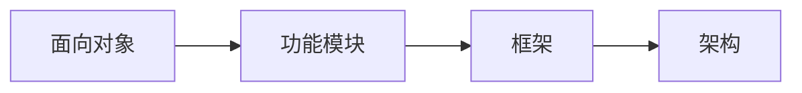

### 关键词

如何向别人介绍？


#### 七大设计原则（SOLID）

- 单一职责原则（Single Responsibility Principle）

> 一个类应该只负责一项职责。
>
> 只有代码逻辑足够简单，才可以违反单一职责原则，只有类内的方法足够少，才可以仅在方法层面实现单一职责原则。

- 开闭原则（Open Closed Principle）

> 对扩展开放，对修改关闭

- 里氏替换原则（Liskov Substitution Principle）

> 在所有引用基类的地方必须能透明地使用其子类的对象。
>
> 在继承时，子类不要重写父类的方法。
>
> 在适当的时候，可以通过聚合、组合、依赖来解决问题。

- 迪米特法则（Law Of Demeter）

> 一般称出现在成员变量、方法参数、方法返回值的类为该类的直接朋友，意味着陌生的类最好不要以局部变量的形式出现在类的内部。

- 接口隔离原则（Interface Segregation Principle[**ISP**])

> 客户端不应该依赖它不需要的接口，即一个类对另一个类的依赖应该建立在最小的接口上。

- 依赖倒置原则（Dependence Inversion Principle[**DIP**])

> 程序应该依赖于抽象接口，细节依赖于（具体实现）接口。

```java
package com.atguigu.principle.inversion.improve;

public class DependecyInversion {

	public static void main(String[] args) {
		//客户端无需改变
		Person person = new Person();
		person.receive(new Email());
		
		person.receive(new WeiXin());
	}

}

//定义接口
interface IReceiver {
	public String getInfo();
}

class Email implements IReceiver {
	public String getInfo() {
		return "电子邮件信息: hello,world";
	}
}

//增加微信
class WeiXin implements IReceiver {
	public String getInfo() {
		return "微信信息: hello,ok";
	}
}

//方式2
class Person {
	//这里我们是对接口的依赖
	public void receive(IReceiver receiver ) {
		System.out.println(receiver.getInfo());
	}
}

```


#### UML类图

#### 源码剖析

代码分析+Debug+对应模式分析说明

#### 常见应用

状态模式：例如金融项目中的贷款申请的状态更新

解释器模式

### 设计模式分类

#### 创建型（5）

单例模式、抽象工厂模式、原型模式、建造者模式、工厂模式

#### 结构型（7）

适配器模式、桥接模式、装饰模式、组合模式、外观模式、享元模式、代理模式

#### 行为型（11）

模板方法模式、命令模式、访问者模式、迭代器模式、观察者模式、中介者模式、备忘录模式、解释器模式（Interpreter模式）、状态模式、策略模式、职责链模式（责任链模式）

### 单例模式

> 采取一定方法保证在整个软件系统中，对某个类只能存在一个对象实例，并且该类只提供一个取得其对象实例的方法（静态方法）。

### 面试题

设计模式的意义？即**代码重用性、可读性、可维护性、可靠性**等等，目的是使程序呈现**高内聚、低耦合**的特性。

设计模式在软件开发中的哪里进行应用？（项目？框架？）



面向对象（oo），功能模块（设计模式+算法【数据结构】），框架（多种设计模式），架构（服务器集群）

#### 单例模式一共有几种实现方式？请用代码实现，并说明各个实现的优缺点？

饿汉式（两种）

懒汉式（三种）

双重检查

静态内部类

枚举